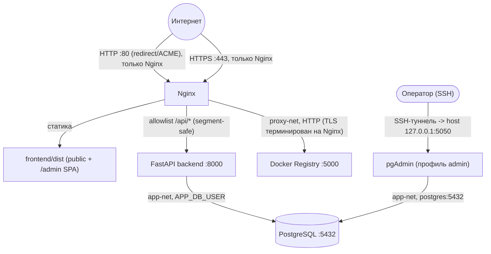
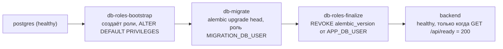
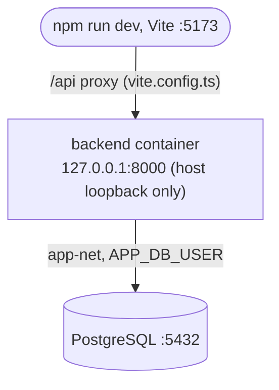

# Архитектура vibe-order-infra

Этот документ объясняет систему инженеру, который впервые открывает
репозиторий — без необходимости реконструировать её из Compose-файлов и
кода вручную. Здесь — про устройство и границы ответственности; конкретные
команды деплоя — [DEPLOYMENT.md](DEPLOYMENT.md), операционные процедуры —
[RUNBOOK.md](RUNBOOK.md), полная API allowlist-матрица, Nginx-конфигурация
построчно и историческая VPS-приемка — [../README.md](../README.md).

## 1. Обзор системы

Пять логических компонентов:

- **Публичный SPA** (`frontend/`, Vite/TypeScript) — форма заявки, выбор
  услуги и бюджета.
- **Административный SPA-роут** (`/admin`) — тот же frontend-бандл, вкладки
  "Услуги"/"Заявки"/"Статистика"; клиентский auth-gate через `/api/auth/*`.
- **Nginx** — единственный сервис, публикующий порты на все интерфейсы
  (80/443); отдаёт статику, проксирует allowlist `/api/`-сегментов,
  проксирует Docker Registry.
- **FastAPI backend** — вся бизнес-логика, аутентификация, доступ к БД;
  порт не публикуется на host в production (локальная разработка —
  исключение, см. §8).
- **PostgreSQL** — единственное хранилище состояния; порт не публикуется на
  host ни в одном окружении.

Плюс одноразовые lifecycle-сервисы миграции схемы (`db-roles-bootstrap`,
`db-migrate`, `db-roles-finalize` — см. §5); приватный Docker Registry —
обычный сервис production-конфигурации **по умолчанию** (без Compose-
профиля — Nginx объявляет на него `depends_on: condition: service_started`,
т.е. Nginx ждёт его старта), обслуживающий доставку production-образов
backend; и pgAdmin — единственный по-настоящему опциональный сервис
(профиль `admin`, поднимается только по явному запросу, порт только
`127.0.0.1`).

**Production topology:**



Ни один из портов backend/PostgreSQL/Registry не публикуется на host в
production (см. §8 про единственное исключение — локальный override
публикует backend на `127.0.0.1:8000`) — единственный внешний вход
показан на диаграмме явно. Nginx **не** выполняет проверку JWT и не
различает HTTP-методы: он ограничивает только то, какие `/api/`-сегменты
вообще доходят до backend (allowlist), а решение "public или protected,
каким методом, для какой роли" принимает исключительно backend.

Два уточнения к диаграмме, которые легко прочитать неверно:

- **Nginx → Registry — это HTTP, не HTTPS.** TLS терминируется на Nginx
  (внешний клиент доходит до Nginx по HTTP на порту 80 — только
  redirect/ACME — и по HTTPS на порту 443 для обычного трафика); внутри
  `proxy-net` Nginx
  проксирует на Registry по обычному HTTP (`proxy_pass
  http://registry:5000/v2/;`, см. `nginx/conf.d/registry-vibe.elivcloud.org.conf`)
  — второго слоя TLS внутри Docker-сети нет и не предполагается.
- **pgAdmin → PostgreSQL — это НЕ SSH-туннель.** Сама SQL-связь идёт
  напрямую внутри `app-net` по Docker DNS (`postgres:5432`), обычным
  Compose-подключением, без туннеля. SSH-туннель на диаграмме — это
  отдельный путь ОПЕРАТОРА к веб-интерфейсу pgAdmin
  (`SSH-туннель → host 127.0.0.1:5050 → контейнер pgAdmin`), а не путь
  самого pgAdmin к БД. Полная цепочка операторского доступа: оператор →
  SSH-туннель → loopback/опубликованный порт хоста (`127.0.0.1:5050`) →
  контейнер pgAdmin → `app-net` → PostgreSQL (`postgres:5432`).

## 2. Границы доверия и запросов

- **Public-маршруты** (без токена): `/api/health`, `/api/auth/check`,
  `/api/auth/login`, `/api/admin-settings/active`, `POST /api/applications`,
  `POST /api/behavior-metrics`.
- **Protected-маршруты** (`Authorization: Bearer <JWT>`, иначе `401` от
  backend): CRUD услуг, список/детали/приоритизация заявок, behavior
  metrics collection/item, analytics. Полная route-матрица — README,
  "API и публичный security allowlist".
- **Ответственность Nginx**: segment-safe allowlist по `/api/`-префиксам
  (либо точный путь, либо префикс с обязательным `/` перед вложенным
  путём) — всё, что не совпало, получает `404` до backend; плюс TLS,
  security-заголовки, SPA fallback. Nginx не хранит и не проверяет
  какие-либо учётные данные приложения.
- **Ответственность backend**: вся авторизация (`Depends(get_current_admin)`
  на каждом protected route), выпуск и проверка JWT, Argon2id-хэширование
  паролей — единственный источник правды о том, кто администратор.
- **Поведение frontend**: JWT хранится в `sessionStorage` (не
  `localStorage` — забытая открытой вкладка не держит сессию бессрочно),
  прикладывается как `Authorization: Bearer` к защищённым запросам; все
  запросы — same-origin, относительный путь `/api/...` без хардкода
  домена.

## 3. Модель идентичности администратора

Публичной HTTP-регистрации администратора не существует — маршрут
`POST /api/auth/register` отсутствует в коде, а не просто "закрывается
после первого использования". Единственный способ создать первого
администратора — оператор, локально, командой CLI, **до** публичного
открытия сервиса на новой БД:

```bash
docker compose exec -it backend python -m app.cli bootstrap-admin
```

Команда интерактивна (пароль скрыт, нигде не логируется), использует
Argon2id-хэширование и Postgres advisory lock против гонки при
одновременном запуске, и безопасно отказывает, если администратор уже
существует. Восстановленной из backup БД bootstrap не требуется. Дальше
аутентификация — обычный `POST /api/auth/login` → JWT → `Depends(get_current_admin)`
на защищённых маршрутах. Полная процедура и историческая справка — README,
"First production admin".

## 4. Ролевая модель базы данных

Три роли PostgreSQL, не взаимозаменяемые "вкусы" одного креденшла:

| Роль | Кто использует | Права |
|---|---|---|
| Кластерный admin (`POSTGRES_USER`) | контейнер `postgres` (init), `db-roles-bootstrap`/`db-roles-finalize` | Суперпользователь кластера — только для одноразового создания/обслуживания двух ролей ниже. |
| Migration-owner (`MIGRATION_DB_USER`) | `db-migrate` (Alembic) | `CREATE`/`USAGE` на схему `public`, владелец создаваемых таблиц/sequences — не суперпользователь. |
| Runtime-роль (`APP_DB_USER`) | backend, в обычной работе | `SELECT`/`INSERT`/`UPDATE`/`DELETE` на таблицы приложения; без DDL; без доступа к `alembic_version`. |

Backend никогда не подключается миграционным или кластерным креденшлом, и
наоборот — миграционная роль никогда не обслуживает HTTP-трафик. Гарантия
не в том, что роли физически не могут получить доступ друг к другу
(`MIGRATION_DB_USER` как владелец таблиц технически может их читать/писать
в любой момент), а в том, что при штатной работе и даже при компрометации
приложения через уязвимость backend не может выполнить DDL или тронуть
`alembic_version` — только `APP_DB_USER`-права. Живой regression-тест
границ — `backend/tests/test_db_role_privileges.py`.

## 5. Жизненный цикл схемы



Alembic — единственный источник правды о схеме
(`backend/alembic/versions/`, 4 ревизии на текущий момент);
`Base.metadata.create_all()` в коде приложения не используется. Старт
backend (`lifespan` в `app/main.py`) — **read-only** проверка
(`app/core/schema_check.py::ensure_database_ready`), которая отказывает в
старте, если подключённая схема не совпадает с ожидаемой ревизией, а не
пытается сама что-то создать или починить (fail-closed by design).
Migration-owner получает права ровно на схему `public` — миграции не
предполагают работы с какой-либо другой схемой.

Существующая (legacy) production-база, развёрнутая до появления этого
lifecycle, проходит одноразовое **усыновление**
(`app/db_admin/adopt_legacy.py`): read-only-проверка точного фингерпринта
существующих таблиц/колонок/constraints, затем реассайн ownership на
`MIGRATION_DB_USER` и `alembic stamp` на baseline-ревизию. База, чья форма
хоть немного отличается от ожидаемого фингерпринта, отклоняется целиком —
инструмент не пытается угадать частичное соответствие. Полная процедура,
включая точные команды для fresh install и adopt-legacy путей —
[DEPLOYMENT.md](DEPLOYMENT.md), раздел "Provisioning базы данных".

## 6. Корректность данных и приложения

- **Идемпотентность bootstrap-скриптов**: `bootstrap_roles.py` безопасно
  перезапускается на каждом релизе — создание ролей и `ALTER DEFAULT
  PRIVILEGES` не дублируют эффект при повторном прогоне.
- **Транзакционное создание заявки**: `Application` и связанная
  `BehaviorMetric` — независимые операции по дизайну (behavior metrics
  отправляются вторым запросом после успешного создания заявки); неудача
  отправки метрик — best-effort (`console.warn` на frontend), не откатывает
  уже созданную заявку.
- **Материализованный priority score**: приоритет (Высокий/Средний/
  Стандартный) с человекочитаемыми причинами вычисляется и хранится на
  стороне backend, а не пересчитывается на лету при каждом чтении списка —
  список/фильтр по приоритету (`GET /api/applications/prioritized`) не
  требует пересчёта scoring для каждой заявки на каждый запрос.
- **Server-side пагинация/поиск/фильтрация** заявок по приоритету — на
  стороне backend/БД, не на frontend.
- **Behavior-метрики — только агрегаты**: `time_on_page`, `clicked_buttons`,
  `cursor_hover_data`, `return_count` — счётчики и суммарное время по
  именованным секциям/кнопкам; содержимое полей формы и точные координаты
  курсора не собираются и не хранятся.

## 7. Топология контейнеров и сети

Две Docker-сети разделяют внешний и внутренний контуры:

- **proxy-net** — Nginx + Registry + backend (backend подключён сюда
  только для того, чтобы Nginx мог его проксировать — сам он порт наружу
  не публикует).
- **app-net** — PostgreSQL + backend + pgAdmin; точки входа снаружи нет,
  кроме опционального loopback-порта pgAdmin.

PostgreSQL не публикует порт на host ни в одном окружении. Backend не
публикует порт на host **в production**; локальная разработка — намеренное
исключение (`docker-compose.local.yml` публикует его на `127.0.0.1:8000`,
см. §8) — оба варианта доступны только по внутреннему Docker DNS внутри
своих сетей, когда порт всё же не опубликован. pgAdmin — Compose-профиль
`admin`, не поднимается обычным `docker compose up`, порт только
`127.0.0.1:5050` (доступ с локальной машины к веб-интерфейсу — через
SSH-туннель; сама БД-связь pgAdmin → PostgreSQL идёт отдельно, напрямую по
`app-net` на `postgres:5432` — см. уточнения к диаграмме в §1).

Container hardening (проверено живым disposable-стеком):
`no-new-privileges` на postgres/backend/registry/nginx — то есть на всех
долгоживущих сервисах, КРОМЕ pgAdmin (см. ниже) — и на всех трёх one-shot
lifecycle-сервисах; `cap_drop: ALL` + `read_only` + tmpfs на backend и
lifecycle-сервисах (чистый Python-процесс без записи на собственную ФС);
`cap_drop: ALL` с точечным `cap_add` (`NET_BIND_SERVICE`, `SETUID`,
`SETGID`, `CHOWN`) на Nginx. PostgreSQL и Registry получили только
`no-new-privileges` — их entrypoint'ы делают root-level инициализацию
(chown тома, init-скрипты) перед сбросом привилегий. **pgAdmin — явное
исключение из общего правила**: он не получил даже `no-new-privileges` —
живая проверка показала, что под этим флагом сам pgAdmin детектирует
"restricted security context" и молча переключает внутренний порт
прослушивания с 80 на 8080, ломая фиксированный проброс
`127.0.0.1:5050:80`. Полное обоснование для каждого сервиса, включая этот
сознательный откат hardening — README, "Security notes / ограничения".

## 8. Локальная топология vs production

**Local development topology:**



- `docker-compose.local.yml` — override, который гасит `nginx`/`registry`
  (VPS-only volume-мounты не трогаются) и публикует `backend` только на
  `127.0.0.1:8000` — единственное окружение, где backend вообще
  публикует порт на host (см. §1/§7 — в production этого порта нет).
- `postgres` → lifecycle-цепочка (§5) → `backend` — та же цепочка, что и в
  production, просто без Nginx/Registry вокруг неё.
- Frontend — Vite dev-сервер на хосте (`npm run dev`), с dev-only proxy
  `/api` → `http://127.0.0.1:8000` в `vite.config.ts`.
- Production TLS-сертификаты, домены, Registry-креденшлы и
  `registry/auth/htpasswd` не нужны и не используются.

**Production topology** (полная диаграмма — §1):

- Nginx — TLS (Let's Encrypt), security-заголовки, allowlist, раздача
  собранного `frontend/dist` как статики.
- `frontend/dist` собирается **вне VPS** и доставляется как
  версионированный artifact с SHA-256 контрольной суммой — не собирается
  на месте.
- Backend-образ доставляется через приватный Docker Registry (см. §9) —
  `build: ./backend` в Compose-декларации на VPS не используется никогда.

Один и тот же `docker-compose.yml` — источник истины для обоих контуров;
разница выражена исключительно через override-файл и набор поднимаемых
сервисов, не через отдельную вторую конфигурацию.

## 9. Жизненный цикл образа для деплоя

```
immutable release image (собран вне VPS, тег = git SHA/semver)
  → явная доставка на VPS (docker pull из Registry, либо
     docker save/scp/docker load при первом деплое)
  → верификация (сверка Image Id/контрольной суммы)
  → docker tag на локальный alias vibe-order-infra-backend:latest
  → docker compose up -d --no-build
```

`--no-build` — принципиальный момент: он запрещает Compose собрать образ
прямо на VPS, даже если бы локальный тег оказался отсутствующим, вместо
того чтобы тихо провалиться в build-fallback. Точные команды (`docker
buildx build`, `docker push`/`pull`, `docker tag`, backup перед
схема-меняющим релизом, порядок "миграция до пересоздания backend") —
[DEPLOYMENT.md](DEPLOYMENT.md), не дублируются здесь.

## 10. Recovery / эксплуатация

Коротко: backup — `pg_dump --clean --if-exists` с проверкой и кода
возврата, и непустого файла, вне репозитория; restore — в заведомо чистую,
пересозданную базу (не поверх текущей — иначе локальный drift, которого
нет в самом дампе, переживёт restore нетронутым); ротация паролей ролей —
двухфазная для кластерного admin (сначала меняется пароль в PostgreSQL
действующим credential'ом, потом обновляется `.env`). Полные команды и
обоснование каждого шага — [RUNBOOK.md](RUNBOOK.md).

## 11. Ключевые инженерные решения

- **Почему Alembic, а не создание схемы во время выполнения** —
  `Base.metadata.create_all()` не даёт управляемого, воспроизводимого пути
  апгрейда и не различает "схема не создана" от "схема устарела"; fail-
  closed readiness-проверка (§5) в паре с explicit-миграциями делает
  рассинхронизацию схемы видимой сразу при старте, а не тихой.
- **Почему роли БД разделены** — ни backend, ни сама миграция не должны
  располагать правами сверх необходимых им; разделение ограничивает ущерб
  от компрометации приложения одним DML на таблицах приложения, без DDL и
  без доступа к `alembic_version`.
- **Почему production-образы immutable** — детерминированный тег (git
  SHA/semver) на каждом релизе делает деплой воспроизводимым и
  инспектируемым (сверка Image Id перед переключением алиаса); `:latest`
  как единственный тег не дал бы такой гарантии.
- **Почему local и production Compose-пути различаются** — production
  Nginx требует реальный TLS-сертификат, собранный frontend и Registry-
  креденшлы, которых на чистом клоне нет и быть не может; override-файл
  меняет только набор поднимаемых сервисов и публикацию порта backend, не
  сам lifecycle схемы БД.
- **Почему Nginx allowlist не считается авторизацией** — allowlist отвечает
  только на вопрос "доходит ли этот `/api/`-сегмент до backend вообще";
  какой конкретно метод/путь public, а какой требует JWT, решает
  исключительно backend — единый источник правды вместо двух независимых
  систем авторизации, которые могли бы разойтись.

Эта секция — не ADR-архив, а сжатый список решений, наиболее вероятных к
вопросу "а почему не иначе?" при первом чтении репозитория; более
подробный нарратив по каждому пункту, включая исторический контекст
(`Stage 1–5`), — README, разделы "Почему так" и "Дальше по плану".
